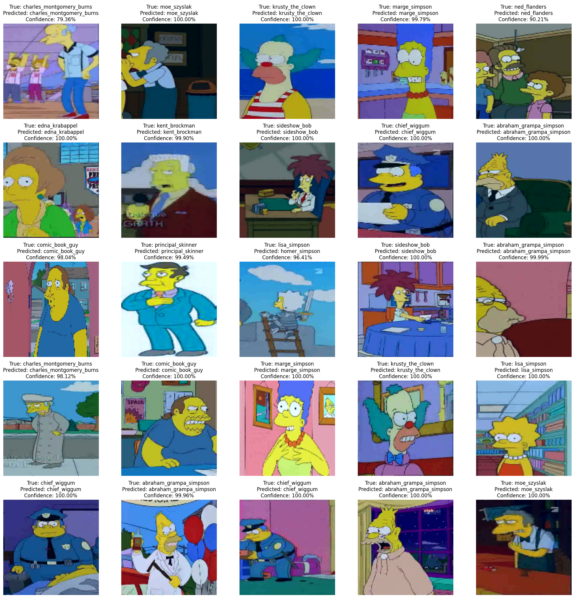
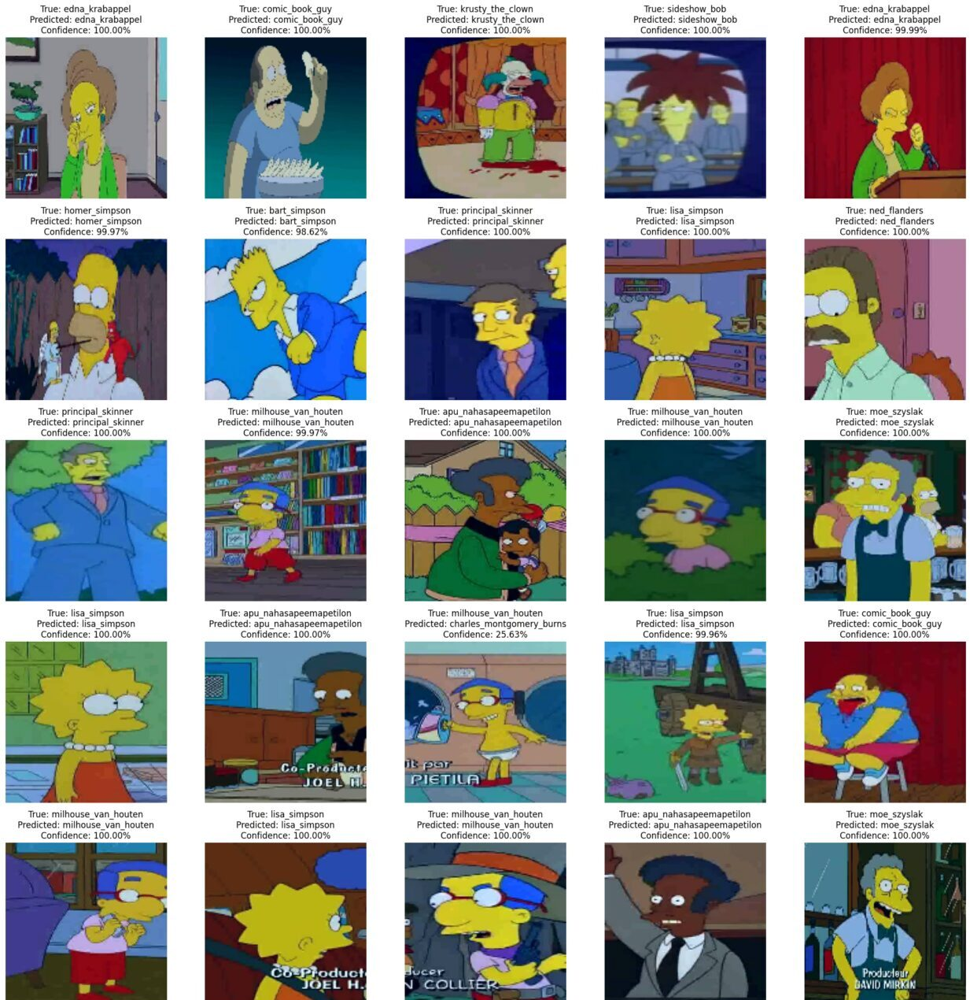

# Advanced ConvNet50 for Detecting Simpsons Characters  
**Transfer Learning, Data Augmentation & Fine-Tuning**

RESNET50 • CNN • TRANSFER LEARNING • DATA AUGMENTATION • KAGGLE DATASET

**Author:** Luca Amore  
📧 luca.amore at gmail.com  
🌍 https://www.lucaamore.com

---

## 🎯 Project Overview

This project explores **character recognition** from *The Simpsons* TV show using a modern **Convolutional Neural Network** approach.  
Starting from a **pre-trained ResNet50** backbone (trained on ImageNet), a **transfer learning** pipeline was designed to classify **42+ iconic characters** from the show.

Perfect for demonstrating:
- Feature extraction via deep residual networks  
- Robust data augmentation to prevent overfitting  
- Fine-tuning on domain-specific datasets  
- Real-world deployment potential on entertainment/comics datasets  

---

## 🧠 Model Architecture

✔ **Base Model**: ResNet50 (frozen convolutional layers initially)  
✔ **Classifier Head**:
- Global Average Pooling
- Dense + ReLU
- Dropout regularization
- Final Dense Softmax output layer

✔ **Training Strategies**
- Initial training with frozen backbone
- Fine-tuning last residual blocks
- Early stopping and learning-rate scheduling

---

## 🧪 Dataset

👉 Kaggle: **The Simpsons Characters Dataset**  
A curated set including thousands of labeled images of the show’s characters.

Dataset contains:
- High intra-class variability (expressions, clothing, scenes)
- Real-world occlusions and backgrounds
- Uneven sample distribution across characters

🔗 https://www.kaggle.com/datasets/alexattia/the-simpsons-characters-dataset

Images are processed through:
- Random rotation & flipping
- Label-preserving shifts and zooms
- Normalization to ImageNet mean/std

---

## 📊 Performance

Key Metrics:
- Accuracy
- Validation loss trend
- Confusion matrix for character confusion patterns

> Best-performing configuration after fine-tuning showed strong separation even between visually similar characters.

# Results

---

## 🛠️ Tech Stack

| Component | Version |
|----------|---------|
| Python | 3.10 |
| TensorFlow | 2.x |
| Keras | Latest API |
| GPU Acceleration | Optional (highly recommended) |

Training was executed through Kaggle GPUs.

---

## ▶️ Try It Yourself

Access the runnable training notebook on Kaggle:

🔗 https://www.kaggle.com/code/lucaamore/convnet50-simpson-character-identifer

---

## 📝 Related Blog Article

Detailed walkthrough and project explanation available here:

🔗 https://www.lucaamore.com/?p=2301

---

## 📜 License

Distributed under the **GPL v3** license.  
Feel free to fork, contribute, and extend this project!

---

> _D’oh! Let’s see if neural networks can tell Homer apart from Ned Flanders..._

